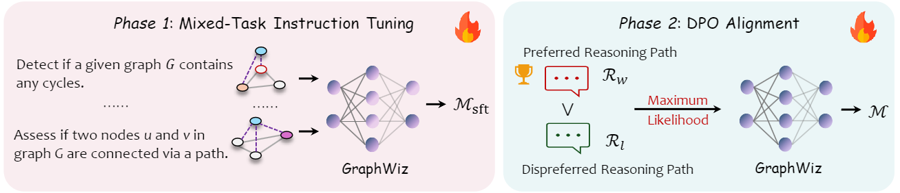

# DSAA5000E-GraphWiz

This repo contains the training code and demo of GraphWiz. The model has been published to Hugginface.

To run the demo, run: 

```
python gradio-app.py
```

It will download the LLaMA-2-7B-DRO model from Hugginface, and provide a demo running on http://127.0.0.1:9999.

This repository remains almost identical with the repository from <a href = "https://graph-wiz.github.io/">[The Project Page]</a>.

Below is the usage and reproduce instructions from the original readme file.


## Usage & Download

Our checkpoints and dataset are avaliable at HuggingFace. You can directly download them according to the following links:

### 🤗Models🤗


| GraphWiz   	| Mixed-Task Training                                       	| DPO                                                       	|
|-----	|---------------------------------------------------------------	|---------------------------------------------------------------------------	|
| 🤗**7B-LLaMA 2**  	| 🪄 [**GraphWiz-7B**](https://huggingface.co/GraphWiz/LLaMA2-7B), [**GraphWiz-7B-RFT**](https://huggingface.co/GraphWiz/LLaMA2-7B-RFT)    	| 🪄 [**GraphWiz-7B-DPO**](https://huggingface.co/GraphWiz/LLaMA2-7B-DPO)  	|
| 🤗**13B-LLaMA 2** 	| 🪄 [**GraphWiz-13B**](https://huggingface.co/GraphWiz/LLaMA2-13B), [**GraphWiz-13B-RFT**](https://huggingface.co/GraphWiz/LLaMA2-13B-RFT)	| 🪄 [**GraphWiz-13B-DPO**](https://huggingface.co/GraphWiz/LLaMA2-13B-DPO)	|
| 🤗**7B-Mistral** 	| 🪄[**GrpahWiz-7B**](https://huggingface.co/GraphWiz/Mistral-7B), [**GrpahWiz-7B-RFT**](https://huggingface.co/GraphWiz/Mistral-7B-RFT)   	| 🪄 [GraphWiz-7B-DPO] 	|


### 🤗Dataset🤗

 🤗[**GraphInstruct**](https://huggingface.co/datasets/GraphWiz/GraphInstruct), 
 
 🤗[**GraphInstruct-RFT**](https://huggingface.co/datasets/GraphWiz/GraphInstruct-RFT-72K)  

 🤗[**GraphInstruct-DPO**](https://huggingface.co/datasets/GraphWiz/GraphInstruct-DPO)  

 🤗[**GraphInstruct-Test**](https://huggingface.co/datasets/GraphWiz/GraphInstruct-Test)  


*-vanilla version means to our model only trained with Q:R=1:1

*-RFT refers to our model trained with all Q-R paths


## **Table of Contents**

- [ℹ QuickStart](#quick-start)
- [🛠️ Training and Inference](#training-graphwiz)
- [📜 Data Generation](#graphinstruct-construction)


### Quick Start


```
# Use a pipeline as a high-level helper
from transformers import pipeline

pipe = pipeline("text-generation", model="GraphWiz/Mistral-7B")
alpaca_template = "Below is an instruction that describes a task. Write a response that appropriately completes the request. \n### Instruction:\n{query}\n\n### Response:"

query = "Find the shortest path between two nodes in an undirected graph. In an undirected graph, (i,j,k) means that node i and node j are connected with an undirected edge with weight k. Given a graph and a pair of nodes, you need to output the shortest path between the two nodes. Q: The nodes are numbered from 0 to 8, and the edges are: (0,1,4) (1,2,7) (1,7,1) (1,3,4) (2,6,2) (2,4,8) (2,7,5) (3,6,1) (4,8,3) (5,6,6) (6,8,8) (7,8,7). Give the weight of the shortest path from node 0 to node 8."


input = alpaca_template.format(query = query)

output = pipeline(input)[0]['generated_text']
print(output)
```
## Training GraphWiz 


Our training strategies include two stage: **Mixed-task Training** and **DPO Alignment**.

<br>
<div align="center">
  
</div>


Before we start, we need to transfer our data into the [deepspeed](https://github.com/microsoft/DeepSpeedExamples/tree/master/applications/DeepSpeed-Chat/training/step1_supervised_finetuning) training format.

You can see examples in our **dataset/GraphInstruct-DPO-ds.json** file.


### Requirements

```
pip -r install requirements.txt
```

### Phase1: Mixed-Task Training 

```
cd training/step1_supervised_finetuning
bash training_scripts/single_node/run_graph.sh
```

which consists of the following commands:

```

#!/bin/bash
# Copyright (c) Microsoft Corporation.
# SPDX-License-Identifier: Apache-2.0
# DeepSpeed Team
OUTPUT=$1
ZERO_STAGE=$2
DATA_PATH=$3
MODEL_PATH=$4
if [ "$OUTPUT" == "" ]; then
    OUTPUT=/output/deepspeed/nlgreasoning/
fi
if [ "$ZERO_STAGE" == "" ]; then
    ZERO_STAGE=3
fi 
mkdir -p $OUTPUT

deepspeed --include localhost:0,1,2,3 --master_port=25001 main.py  \
   --data_path local/jsonfile_graph/$DATA_PATH \
   --data_split 10,0,0 \
   --model_name_or_path $MODEL_PATH \
   --per_device_train_batch_size 4 \
   --per_device_eval_batch_size 2 \
   --max_seq_len 2048 \
   --learning_rate 5e-6  \
   --weight_decay 0. \
   --num_train_epochs 2  \
   --gradient_accumulation_steps 2 \
   --lr_scheduler_type cosine \
   --num_warmup_steps 500 \
   --seed 1234 \
   --save_interval 5000 \
   --zero_stage $ZERO_STAGE \
   --deepspeed \
   --data_output_path $OUTPUT \
   --gradient_checkpointing \
   --output_dir $OUTPUT \
   &> $OUTPUT/training.log &

```


### Phase2: DPO Training 


```bash
cd training/step2_dpo_training
bash training_scripts/single_node/run_graph.sh
```

which consists of the following commands:

```

#!/bin/bash
# Copyright (c) Microsoft Corporation.
# SPDX-License-Identifier: Apache-2.0
# local/xjsonfile/rftV2
# DeepSpeed Team
OUTPUT=$1
ZERO_STAGE=$2
DPO_PATH=$3
SFT_PATH=$4
if [ "$OUTPUT" == "" ]; then
    OUTPUT=output/deepspeed/nlgreasoning/dpo_beta0.5/
fi
if [ "$ZERO_STAGE" == "" ]; then
    ZERO_STAGE=3
fi
mkdir -p $OUTPUT

deepspeed --include localhost:0,1,2,3,4,5,6,7 --master_port=25001 main.py  \
   --data_path local/jsonfile_graph/$DPO_PATH \
   --data_split 0,10,0 \
   --model_name_or_path $SFT_PATH \
   --per_device_train_batch_size 2 \
   --per_device_eval_batch_size 2 \
   --max_seq_len 2048 \
   --learning_rate 5e-6  \
   --weight_decay 0. \
   --num_train_epochs 3  \
   --gradient_accumulation_steps 2 \
   --lr_scheduler_type cosine \
   --num_warmup_steps 100 \
   --seed 1234 \
   --beta 0.5 \
    --print_loss \
   --zero_stage $ZERO_STAGE \
   --deepspeed \
   --data_output_path $OUTPUT \
   --gradient_checkpointing \
   --output_dir $OUTPUT \
   &> $OUTPUT/training.log &

```


### Inference & Test

```
cd evaluation
bash test_graph.sh
```


## GraphInstruct Construction


<br>
<div align="center">
  
</div>


If you want to construct additional graph problem data for training your own models for graph problem reasoning. Please refer to the following:

### Generate Graph Problems

#### step1: Generate all train set

```
cd scripts
bash generate_all_train_datasets.sh
```

#### Generate all test set

```
cd scripts
bash generate_all_test_datasets.sh
```

### Step2: Data Augmentation with Rejection Sampling
Here, we introduce how to select diverse paths for dpo training data:

#### Step2.1: Inference SFT model multiple times
 Suppose we already have the sft model. You can directly use our models at HuggingFace: [**GraphWiz**](https://huggingface.co/GraphWiz)
```
cd evaluation
bash rft.sh
```
The default inference times 'seed' is set to 20.

#### Step2.2: Select the diverse paths 

Then we filter out the diverse reasoning paths:

```
cd find_paths
python3 select_path_dpo.py

python3 find_path.py
```

Please note that you should changle the data paths according to your local enviroment.
